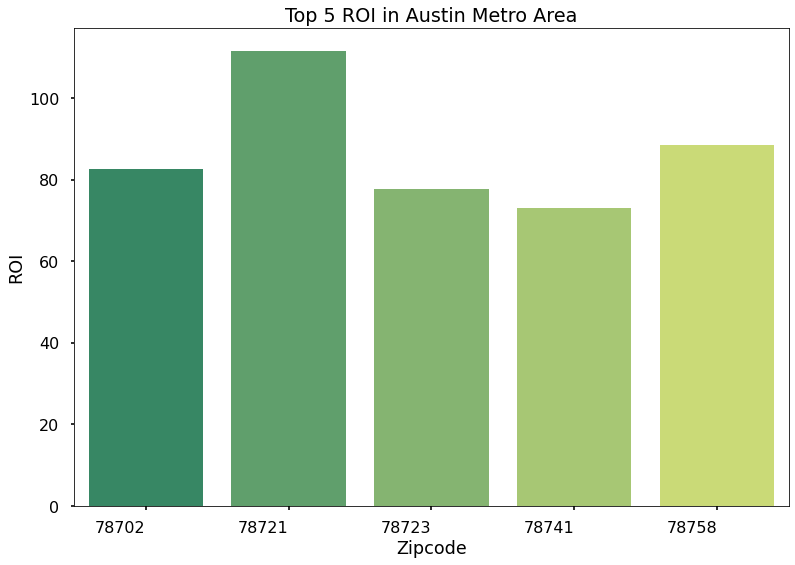
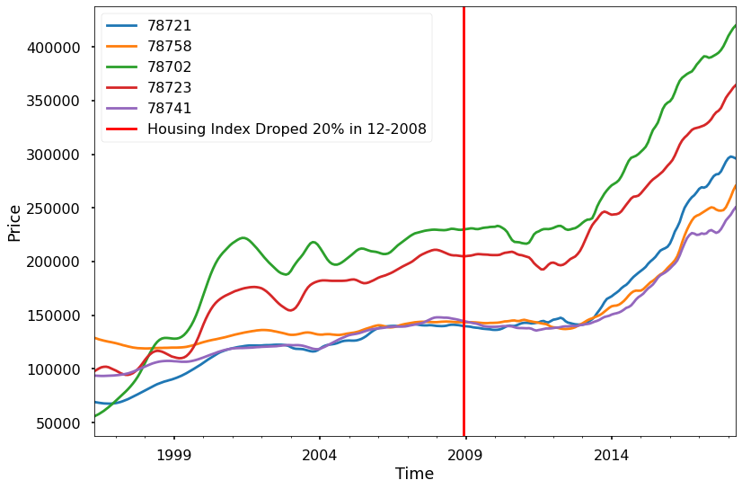
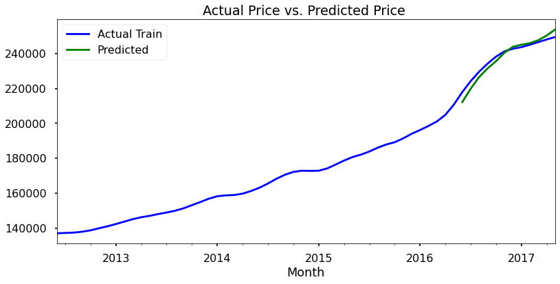
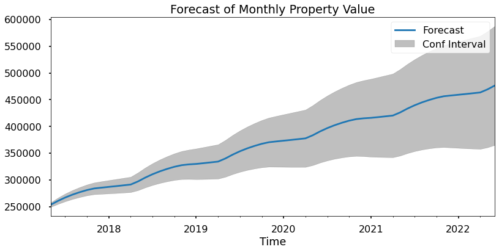
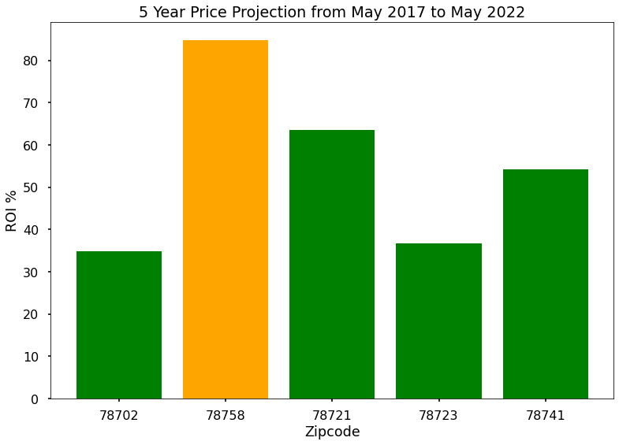

# Austin Metro Area Housing Investment Proposal


# Business Problem

This project is to help our client, an individual investor, who is interested in finding an investment property in Austin Metro Area in Texas. We selected top 5 zip codes he/she should invest in. We used Return on Investment(ROI) in selected zip codes and chose the one with the highest ROI. Our ultimate goal is to offer our client the greatest investment success.

# Data

- Zillow Housing Data from April 1996 to April 2018
- 14723 Zip codes
- 7554 City
- 51 States
- 701 Metro Area

# Methods

- Selected top 5 ROI zip codes in Austin metro area from 2009-01 to 2018-04
- Train data : Jan 2009- April 2017 housing prices
- Test data: May 2017 - May 2018 housing prices
- Used grid search to identify the set of parameters that produces the best fitting model to selected 5 zip codes and validate the model
- Predicted May 2017- May 2022 housing prices  
- Calculated the ROI by 5 year price prediction and chose the zip code with the highest ROI







- Predicted May 2017- May 2022 housing prices  



- Used 5 year price projection to get the ROI for selected zip codes
- Zip code 78758 has the highest ROI 84.89%



# Recommendation

- Austin has become a tech hub in the last five to six years, and it’s a hot spot for growing tech companies
- Austin consistently ranks as one of the best places to live, start a business, raise a family, and the most popular city for migration
- Suggested the investor to look for a property in zip code 78758


# Next Step

- Paying cash or mortgage makes difference
- Analyze rental price to obtain annual return if available
- Housing type - Apartment, Townhouse or Single House
- Use the model to predict other interested state, metro area to find the property with highest ROI to invest in


```python

```
